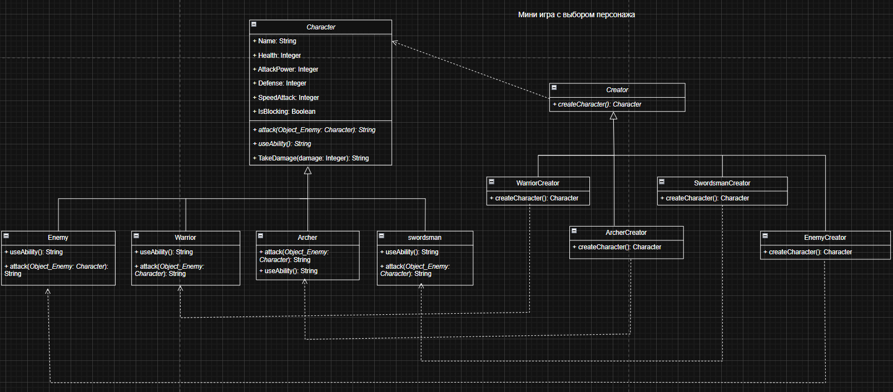

### Отчет

##### **Описание проблемы**

В разработке игр часто возникает ситуация, когда нужно создавать разных персонажей — воинов, лучников и тд. Если писать код «в лоб», то при нажатии каждой кнопки выбора героя нам пришлось бы вручную прописывать все его характеристики (здоровье, урон, броню) прямо внутри формы. Это делает код очень запутанным и громоздким. Главная сложность здесь в том, что программа становится слишком зависимой от конкретных классов, и если мы захотим добавить нового героя или изменить старого, нам придется перерывать весь код интерфейса и вносить правки в куче разных мест.

##### **Решение и использование паттерна**

Чтобы решить эту проблему, в проекте был использован паттерн «Фабричный метод». Идея в том, что мы отделяем логику использования персонажа от логики его создания. У нас есть общая «схема» персонажа и общая «схема» создателя. Вместо того чтобы форма сама создавала воина или лучника через new, она просто обращается к специальному объекту-фабрике и просит его: «Сделай мне кого-нибудь». Конкретные фабрики (например, для воина или мечника) сами знают, какие параметры выставить герою. Таким образом, код самой битвы остается универсальным и работает с любым персонажем, которого пришлет фабрика.

##### **Диаграмма классов**

**Рисунок 1 - паттерн «Фабричный метод» в архитектуре мини-игры с выбором персонажей**

#### **Вывод**

Использование этого паттерна заметно упростило структуру программы. Код формы стал намного чище, так как теперь он отвечает только за нажатие кнопок и отображение полосок здоровья, а не за настройки баланса героев. Теперь, если мы решим добавить в игру нового персонажа, нам не нужно будет трогать логику боя или менять код кнопок — достаточно будет просто дописать новый класс героя и его фабрику. Программа стала гибкой, а риск что-то сломать при обновлении значительно снизился.