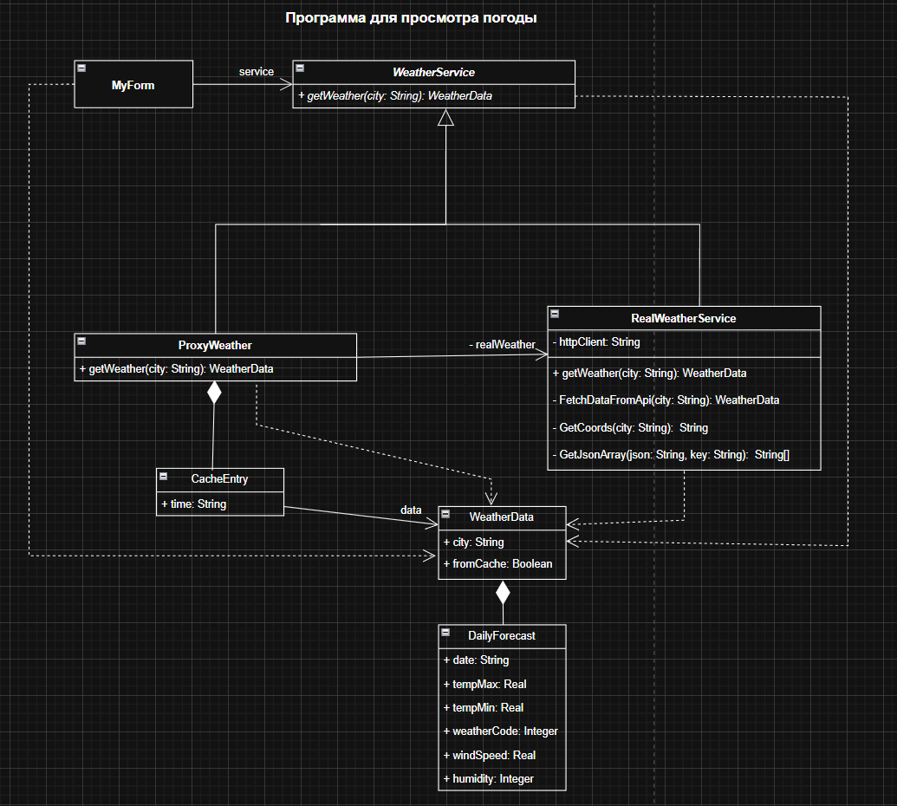

### Отчет

**Описание проблемы.**

В разрабатываемом приложении для просмотра прогноза погоды получение актуальных данных осуществляется через сетевые запросы к внешнему API (Open-Meteo). Основная проблема заключается в том, что пользователи могут многократно запрашивать погоду для одного и того же города за короткий промежуток времени (например, при случайном двойном клике или при частом переключении вкладок). Прямое обращение к внешнему сервису при каждом нажатии кнопки приводит к нерациональному использованию сетевого трафика, задержкам в обновлении пользовательского интерфейса (UI) и риску превышения лимитов на количество запросов к бесплатному API.

**Решение и использование паттерна.**

Для решения описанной проблемы в архитектуру приложения внедрен структурный паттерн проектирования «Заместитель».

Вместо того чтобы форма напрямую обращалась к классу, выполняющему HTTP-запросы, взаимодействие происходит через общий интерфейс (абстрактный класс WeatherService).

- Реальный субъект (RealWeatherService) инкапсулирует сложную логику: формирование URL, геокодинг, скачивание JSON и его парсинг.

- Заместитель (ProxyWeather) перехватывает вызовы от пользовательского интерфейса. Он содержит внутреннюю структуру данных (словарь Dictionary) для хранения уже загруженных прогнозов. При запросе погоды прокси проверяет, есть ли данные для выбранного города в кэше и не устарели ли они (срок жизни кэша установлен на 15 минут). Если данные актуальны, они мгновенно возвращаются из памяти. В противном случае прокси делегирует вызов реальному сервису, получает свежие данные, сохраняет их копию у себя и только затем отдает форме.

**Диаграмма классов для архитектуры приложения с применением паттерна.**

Рисунок 1 - паттерн «Заместитель» в архитектуре приложения для просмотра погоды

**Вывод**

Внедрение паттерна «Заместитель» оказало существенное положительное влияние на приложение:

1) Производительность: Повторные запросы для одного и того же города обрабатываются мгновенно, так как исключается задержка на сетевое соединение. Пользовательский интерфейс стал более отзывчивым.

2) Экономия ресурсов: Существенно снизилась нагрузка на внешний погодный API, что предотвращает блокировку приложения со стороны провайдера данных.

3) Чистота архитектуры: Выполнено разделение обязанностей. Код формы (MyForm) остался чистым и отвечает только за отрисовку, класс RealWeatherService занимается исключительно сетью, а ProxyWeather берет на себя управление памятью и кэшем. Система стала гибкой: логику кэширования можно изменять, не затрагивая код интерфейса или парсинга.