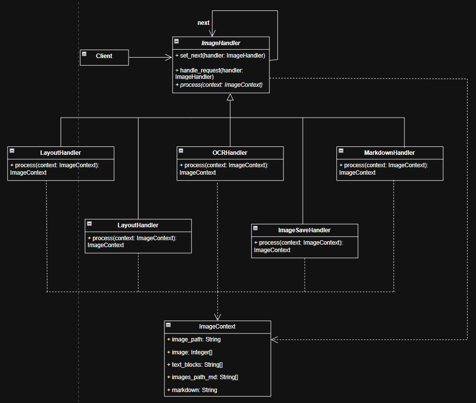

### Отчет

**Описание проблемы**

В процессе интеллектуальной обработки документов требуется последовательное выполнение разнородных и ресурсоемких операций: открытие файла, анализ макета (Layout), распознавание текста (OCR), формирование разметки и сохранение результата. Основная трудность заключается в жесткой связанности этих этапов. Если реализовывать логику в одном контроллере, код становится громоздким и трудноизменяемым. Кроме того, при обработке разных типов изображений может потребоваться пропуск определенных этапов или изменение их порядка, что при монолитной архитектуре ведет к созданию сложных вложенных условий if-else и затрудняет масштабирование системы (например, при добавлении этапа фильтрации шумов).

**Решение и использование паттерна** 

Для организации гибкого конвейера обработки внедрен поведенческий паттерн «Цепочка обязанностей». Центральным элементом выступает абстрактный класс ImageHandler, который определяет метод process и хранит ссылку на следующего обработчика (next).

Конкретные звенья цепочки — OpenImageHandler, LayoutHandler, OCRHandler, MarkdownHandler и ImageSaveHandler — реализуют строго определенную часть логики:

- OpenImageHandler проверяет пути и типы файлов, открывая изображение;

- LayoutHandler формирует шаблон документа;

- OCRHandler распознает текст;

- ImageSaveHandler создает целевую директорию и сохраняет в нее изображения;

- MarkdownHandler генерирует финальный Markdown-файл.

Все данные передаются через объект ImageContext, выступающий общим состоянием (хранит пути, матрицы пикселей, координаты блоков и итоговый текст). Клиент инициирует выполнение, передавая контекст первому звену. Каждый обработчик модифицирует ImageContext и передает управление дальше по цепи. Это позволяет динамически настраивать процесс, добавляя или удаляя этапы без изменения существующего кода.

**Диаграмма классов для архитектуры приложения с применением паттерна.**

Рисунок 1 - Диаграмма классов для приложения по интеллектуальной OCR обработке изображений c применением паттерна "Цепочка обязанностей"

**Вывод**

Внедрение паттерна «Цепочка обязанностей» позволило декомпозировать сложный процесс обработки изображений на независимые, легко тестируемые модули. Это значительно повысило чистоту кода, так как каждый класс теперь следует принципу единственной ответственности. Система стала адаптивной: мы можем легко менять последовательность обработки или добавлять новые специализированные модули (например, для распознавания таблиц), не затрагивая логику других компонентов. Использование общего объекта ImageContext обеспечило эффективную передачу промежуточных данных между этапами, исключив избыточное копирование информации и упростив отладку конвейера.